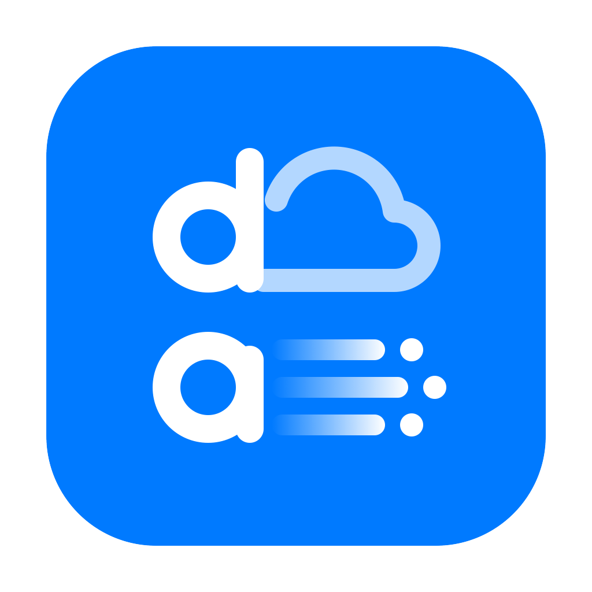

<h1 align="center">Distribution App</h1>

Wholesale distribution management for small businesses in the Philippines — customers, sales orders, invoices,
deliveries, stock, payables, checks, payroll and reports. It runs on one computer in your office; your staff use it
in their browser.

**[Download the latest version →](../../releases/latest)**

## Why Distribution App

- **Your data stays with you.** Everything is stored on your own office computer — no cloud, no monthly server fee, nothing
  is sent to us. It keeps working when the internet is down. Want access outside the office? Connect privately with
  Tailscale; the app is never open to the public internet.
- **Safe.** Every user has their own login and only the permissions you give them. Every change is written to an activity
  log that nobody can edit — not even an admin. Wrong passwords lock the account for a few minutes. A backup is made every
  day and every time the app quits. The page blurs when a computer is left alone. The Mac app is signed and notarized by Apple.
- **Fast.** One small program, no installation of databases or servers. Pages open instantly, even with a year of data
  (tested with 1,000 customers and 15,000 sales orders), and it runs well on an older, low-cost computer.
- **Easy for your team.** Staff open it in the browser on any computer or phone in the office — nothing to install on
  their devices.

## What It Does

- **Sales** — customers with credit terms and limits, sales orders with approval, automatic invoices, delivery tracking
  (Packed → For Delivery → Delivered), payments, post-dated checks, credit memos and statements of account.
- **Inventory** — products in units and cases, stock arrivals with average cost, suggested purchase orders, price list
  import (PDF, Excel or CSV), stock adjustments and days of stock left.
- **Money** — receivables and payables by age, supplier payments, expenses, a 4-week cash forecast, BIR tax estimates and
  payments, and payroll with government contributions and payslips.
- **Accounting** — Income Statement, Balance Sheet, Trial Balance, General Journal and General Ledger, worked out
  automatically from your sales, payments, stock and expenses — nothing to enter twice.
- **Reports** — sales by supplier, brand, product or customer, collection forecast, salesman performance, CSV export.
- **Printouts** — A4 Sales Invoice, Sales Order, Delivery Receipt, Statement of Account and Price List.
- **Your team** — roles for Staff, Salesman and Delivery; permissions down to each report and whether someone sees cost or
  profit; an activity log nobody can edit.
- **Everyday comfort** — approvals with a chime, credit holds for overdue customers, signed delivery receipt photos,
  Dark Mode, per-person accessibility settings, a clean layout on phones and one-click updates.

| Your computer | Download this file |
|---|---|
| Mac | `DistributionApp-<version>-mac.zip` |
| Windows | `DistributionApp-<version>-windows.zip` |

---

## How to Update

**From version 1.1.3 on:** open **Settings → About** and click **Install Update**. The app checks the download is genuine,
saves a backup, keeps the old version and restarts by itself — about a minute. Older versions update once by hand, below.

Your data is stored separately from the app, so updating **never deletes or changes your data**.
Update only the **main computer** (the one running the app). Staff don't need to do anything.

### Mac

1. **Quit the app** — in the app, click your account icon (top right) → **Quit App**.
   A backup is saved automatically.
2. **Download** the Mac file from **[Latest Release](../../releases/latest)** and open it.
3. **Drag DistributionApp** into the same folder as your old one (for example, Applications).
   When asked, click **Replace**.
4. **Open DistributionApp.** Everything is just as you left it.

### Windows

1. **Quit the app** — in the app, click your account icon (top right) → **Quit App**,
   or close the black DistributionApp window.
2. **Download** the Windows file from **[Latest Release](../../releases/latest)**.
3. **Right-click the zip → Extract All**, and extract it into the same folder as your old app.
   When asked, choose **Replace the files in the destination**.
4. **Double-click DistributionApp.exe.** Everything is just as you left it.

### Good to know

- **Use the same folder as before.** If you put the new app somewhere else, go to
  **Settings → Start Up** and switch it **off and on** once, so it starts from the new place.
- **Staff:** after the update, just refresh the page in their browser.
- **How do I know there's an update?** The app checks once a day. Admins see **Update Available**
  at the top of the screen, and **Settings → About → Check for Updates** shows what's new.

---

## Changelog

### Version 1.1.3 (Build 26) — Current · October 10, 2026

> **Windows:** not yet tested on a real Windows PC. The Mac version is tested and notarized by Apple.

- **Fix:** Install Update now installs. If you have 1.1.1 or 1.1.2, download this version once by hand; after that, use Install Update.

[Full list of changes →](../../releases/tag/v1.1.3-build26)

### Version 1.1.2 (Build 25) — October 10, 2026

> **Windows:** not yet tested on a real Windows PC. The Mac version is tested and notarized by Apple.

- **Reports page** — reports as tiles with a short line saying what each one is for.

[Full list of changes →](../../releases/tag/v1.1.2-build25)

### Version 1.1.1 (Build 24) — October 10, 2026

> **Windows:** not yet tested on a real Windows PC. The Mac version is tested and notarized by Apple.

- **Install Update** — one click in Settings → About from now on.
- **Dark Mode** — Light, Dark or Automatic, per person.
- **Accounting** — Balance Sheet, Trial Balance, General Journal and General Ledger.
- **BIR Payments** — record each quarter's tax payment.
- **Reports page** — report groups as tidy tiles.

[Full list of changes →](../../releases/tag/v1.1.1-build24)

### Version 1.1.0 (Build 23) — October 10, 2026

> **Windows:** not yet tested on a real Windows PC. The Mac version is tested and notarized by Apple.

- **Cleaner, calmer design** — everything looks and works more simply, on computers and phones.
- **My Account** — every user can change their own password and set accessibility.
- **Accessibility** — Increase Contrast, Reduce Motion, Reduce Transparency, Bold Text, Button Shapes, Display Zoom.
- **Privacy Screen** — the page blurs when the computer is left alone.
- **More control over permissions** — choose which reports each person sees, and who sees gross profit.
- **Phones** — easy-to-read lists, and printouts that look exactly like paper.
- **Legal & Regulatory** — license, warranty, privacy and open-source notices in Settings.
- **Many fixes** — safer when two people work at the same time, plus licence protection.

[Full list of changes →](../../releases/tag/v1.1.0-build23)

### Version 1.0.1 (Build 22) — October 8, 2026

The first public release.

- **Sales orders** — customer discount applied automatically from SRP, with a margin check while you build the order.
- **Sales Invoice printout** — standard layout with SO number, U/P and discount columns, VAT breakdown and Total Amount Due.
- **Approvals** — a soft chime and badge when something new needs your approval; return to the list after each decision.
- **Checks** — Checks Issued report with Today / Next 7 / Next 30 Days, and a Cleared switch on every check.
- **Outside-office access** — staff can connect securely from their phones using Tailscale.
- **Start Up** — the app can start by itself when the computer turns on.
- **Safe updates** — your data is kept separately, so updating never touches it.
- **Check for Updates** — the app tells you when a new version is out.

---

## Need Help?

Email **totoantonio@gmail.com**

Copyright © 2026 totoantonio
